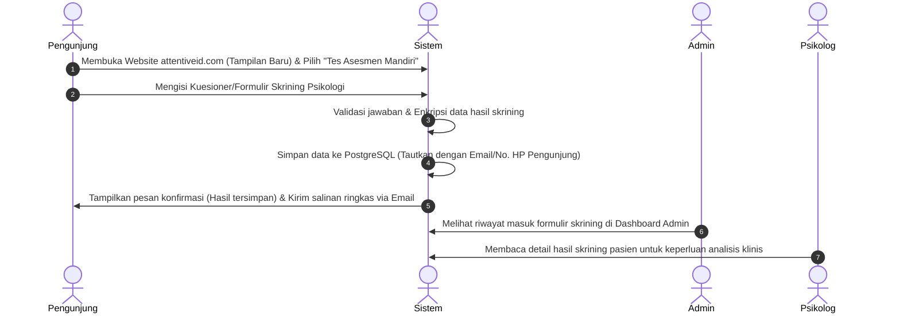
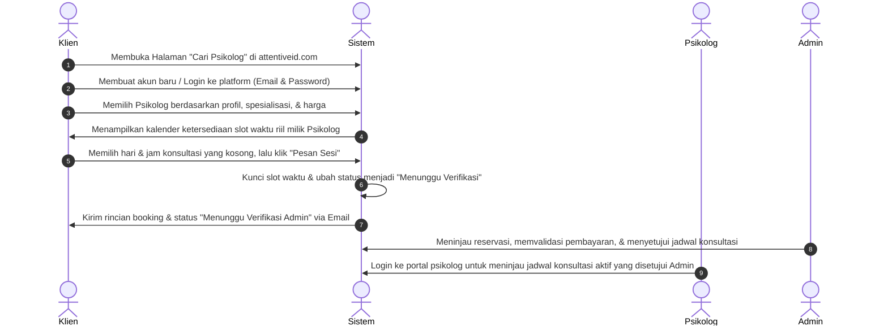

# Proposal Peningkatan Platform & Sistem Operasional Attentive.id
**Transformasi Website Statis Menjadi Platform Manajemen Konsultasi Terintegrasi**

---

## 1. Tujuan Bisnis & Dampak Operasional (Business Goals)

Proyek refaktor dan pengembangan platform Attentive.id bertujuan untuk mentransformasi website profil statis saat ini menjadi sebuah sistem operasional bisnis yang mandiri. Investasi ini difokuskan untuk mencapai target-target bisnis berikut:

```
[Website Statis & Proses Manual] ──> [Platform Otomatis Attentive]
- Pekerjaan Admin Berat (WA/Excel)   - Admin Hanya Memantau & Menyetujui
- Data Skrining Tercecer              - Data Tersimpan Rapi & Terenkripsi
- Potensi Bentrok Jadwal Tinggi      - Zero Double-Booking (Sistem Kalender)
- Sulit Mengukur Konversi Marketing   - Google Analytics & Meta Pixel Terintegrasi
```

*   **Efisiensi Waktu Admin (~70% Waktu Hemat)**: Mengeliminasi proses pencocokan jadwal manual antara pasien dan psikolog melalui WhatsApp. Sistem mengambil alih proses validasi ketersediaan jadwal.
*   **Penyediaan Dua Layanan Mandiri Terpisah**: Menghadirkan portal mandiri terpisah untuk layanan tes skrining psikologi dan layanan reservasi konsultasi, disesuaikan dengan model bisnis Attentive.id.
*   **Peremajaan Tampilan & Pengalihan Server Utama Sejak Awal**: Memperbarui tampilan website utama `attentiveid.com` langsung di akhir Tahap 1 agar menjadi lebih modern dan profesional, serta mengalihkan server dari host statis lama ke VPS baru tanpa downtime.
*   **Layanan Asesmen Mandiri yang Otomatis**: Memfasilitasi pengguna untuk melakukan skrining/asesmen psikologis secara mandiri kapan saja, di mana sistem akan mengolah dan menyimpan data respons mereka secara terstruktur untuk menghasilkan profil psikologis secara instan.
*   **Pencegahan Kehilangan Pendapatan (Zero Double-Booking)**: Menghindari bentrok jadwal konsultasi yang bisa merusak reputasi layanan melalui sistem penguncian transaksi langsung (*database-level transaction lock*).
*   **Pengukuran Efektivitas Pemasaran (Marketing Attribution)**: Terintegrasi dengan analitik untuk melacak dari mana pengunjung datang, berapa yang mengisi survei, dan berapa yang akhirnya melakukan booking.

---

## 2. Alur Perjalanan Pengguna (User Flows)

Karena **Layanan Skrining** dan **Layanan Reservasi Konsultasi** adalah **dua jasa/fitur independen** dengan model bisnis masing-masing, sistem memisahkan perjalanan penggunanya sebagai berikut:

### ALUR A: Layanan Asesmen & Skrining Psikologi Mandiri (Screening Service)
*Layanan bagi pengunjung yang hanya ingin melakukan tes skrining psikologi atau asesmen mandiri tanpa harus memesan sesi konsultasi.*



---

### ALUR B: Layanan Reservasi Konsultasi Psikolog (Booking Service)
*Layanan berbayar bagi klien yang ingin langsung mendaftar dan mengamankan slot waktu konsultasi dengan psikolog pilihan.*



---

## 3. Rencana Rilis & Milestone Manfaat (Milestone Benefits)

Pekerjaan akan diserahkan dalam bentuk fungsionalitas bisnis yang siap pakai di setiap akhir tahapan (Milestone):


### 🏁 Milestone 1: Peluncuran Situs Baru, Pengalihan Domain Utama, & Formulir Skrining (Live: 19 Juli 2026)
*   **Yang Didapatkan Bisnis**:
    *   Website utama baru yang super cepat (mobile-friendly) dan mendukung dual bahasa (Indonesia/Inggris).
    *   Formulir skrining psikologi mandiri yang dinamis. Data langsung tersimpan rapi secara digital.
    *   **Pengalihan Server Utama (`attentiveid.com`)**: Mengalihkan lalu lintas pengunjung dari server statis lama (GitHub Pages) ke server VPS baru secara mulus, sehingga website utama langsung menampilkan desain baru yang modern tanpa ada gangguan akses.
*   **Nilai Bagi Bisnis**: Website utama `attentiveid.com` telah diremajakan dengan tampilan modern secara live di server baru. Bisnis sudah bisa menyebarkan kuesioner baru untuk mengumpulkan data calon pasien secara otomatis.

### 🏁 Milestone 2: Sistem Booking Mandiri & Akun Pengguna (Live: 16 Agustus 2026)
*   **Yang Didapatkan Bisnis**:
    *   Akun login untuk Pasien dan Psikolog terintegrasi pada domain `attentiveid.com`.
    *   Portal peninjauan jadwal bagi Psikolog (meninjau detail reservasi aktif yang disetujui Admin).
    *   Kalender reservasi bagi Pasien (bisa memilih jadwal praktek psikolog) dengan persetujuan akhir oleh Admin.
    *   Sistem proteksi otomatis dari pemesanan ganda di jam yang sama (anti-bentrok database-level).
*   **Nilai Bagi Bisnis**: Meringankan pekerjaan admin karena pemilihan slot waktu dilakukan mandiri oleh klien, sementara kontrol persetujuan akhir jadwal tetap berada di tangan Admin.

### 🏁 Milestone 3: Dashboard Operasional & Serah Terima Penuh (Live: Akhir Agustus)
*   **Yang Didapatkan Bisnis**:
    *   Dashboard Admin Konsolidasi & Kalender Jadwal Internal untuk memantau seluruh jadwal aktif psikolog, statistik pemesanan, dan riwayat skrining pasien secara terpusat.
    *   Sistem backup otomatis (menjamin data medis pasien tidak hilang).
    *   Dokumentasi sistem lengkap & panduan penggunaan untuk admin/psikolog.
*   **Nilai Bagi Bisnis**: Kendali operasional penuh ada di tangan Attentive.id. Sistem siap digunakan untuk jangka panjang secara mandiri tanpa ketergantungan developer.

---

## 4. Fitur Tambahan Nilai Bisnis (Value-Added Deliverables)
*Menjawab tantangan bisnis dari pemilik proyek, kami menambahkan nilai-nilai berikut yang langsung berdampak pada pertumbuhan bisnis (memperkuat justifikasi investasi Rp8.000.000):*

1.  **Integrasi Google Analytics 4 & Meta Pixel (Marketing Tracking)**
    *   *Manfaat*: Owner bisa melihat konversi iklan marketing (misal: berapa biaya iklan yang dihabiskan untuk mendapatkan 1 pasien yang mengisi formulir/booking).
2.  **SEO & Search Indexing Optimization (Google Search Visibility)**
    *   *Manfaat*: Optimasi struktur website (meta tags, JSON-LD schema) agar profil psikolog Attentive mudah ditemukan di pencarian Google saat orang mencari psikolog terdekat.
3.  **Sistem Notifikasi Email Otomatis (Transactional Notifications)**
    *   *Manfaat*: Sistem mengirimkan email otomatis secara instan kepada pasien (bukti reservasi) dan psikolog (notifikasi ada booking baru) sesaat setelah pemesanan dilakukan.
4.  **Standar Keamanan Data Medis Pasien (Data Privacy & Backups)**
    *   *Manfaat*: Database PostgreSQL dikonfigurasi dengan enkripsi saat transit (SSL/TLS) dan terjadwal backup otomatis harian yang di-upload ke penyimpanan awan terpisah untuk menjamin kepatuhan privasi data konseling.
5.  **Jaminan Pemeliharaan Pasca Go-Live (Post-Launch Support SLA)**
    *   *Manfaat*: Layanan bantuan gratis setelah seluruh proyek go-live untuk perbaikan bug dan pemantauan server Tencent Cloud guna memastikan stabilitas operasional.
6.  **Dashboard Kalender Jadwal Internal Terpadu (Internal Operational Calendar)**
    *   *Manfaat*: Tim operasional admin dan psikolog memiliki akses ke satu kalender konsolidasi internal terpadu. Admin dapat melihat siapa saja psikolog yang sedang bertugas, kapan slot kosong berada, dan memantau sesi konseling aktif hari ini. Kelebihan ini menyederhanakan komunikasi tim operasional tanpa harus koordinasi manual lewat chat WhatsApp grup.

---

## 5. Spesifikasi Teknis sebagai Engine Pendukung (Tech Stack)

Teknologi berikut digunakan murni untuk menjamin platform berjalan stabil, memiliki waktu muat di bawah 1.5 detik, dan meminimalisir biaya sewa bulanan server:

*   **Database PostgreSQL**: Dipilih karena keandalannya dalam mengamankan data transaksi reservasi agar tidak korup.
*   **Bun & Elysia Backend Engine**: Teknologi server berkecepatan tinggi yang berjalan efisien pada RAM kecil, membuat biaya sewa VPS Tencent Cloud tetap minim (~Rp200.000/bulan).
*   **React & Tailwind CSS v4 Frontend**: Menjamin tampilan antarmuka sangat responsif, modern, dan memuat halaman secara instan bagi klien di perangkat seluler.
*   **Caddy Reverse Proxy**: Mengatur keamanan SSL (gembok HTTPS) secara otomatis dan gratis selamanya untuk domain `attentiveid.com` di server baru.

---

## 6. Penawaran Biaya Jasa & Jadwal Pembayaran

Model penagihan murni berbasis pencapaian hasil (*Performance-Based*) tanpa DP (*Down Payment*). Klien membayar hanya jika milestone fungsional selesai dikerjakan dan dideploy:

| Fase / Milestone | Deliverable Utama & Hasil Bisnis | Target Waktu | Nominal Jasa (IDR) |
| :--- | :--- | :--- | :--- |
| **Milestone 1** | Peremajaan Tampilan Website `attentiveid.com` Online di Server Baru, Sistem Dual Bahasa, & Formulir Skrining Aktif. | **19 Juli 2026** | Rp 2.500.000 |
| **Milestone 2** | Fitur Login Pasien/Psikolog, Kalender Reservasi Otomatis (Bebas Bentrok), & Notifikasi Email. | **16 Agustus 2026** | Rp 3.000.000 |
| **Milestone 3** | Dashboard Kontrol Admin, Sistem Backup Otomatis, Dokumentasi Lengkap, & Serah Terima Operasional. | **31 Agustus 2026** | Rp 2.500.000 |
| **TOTAL** | **Sistem Operasional Attentive.id Siap Pakai & Garansi Pemeliharaan.** | **31 Agustus 2026** | **Rp 8.000.000** |

*Catatan: Biaya operasional VPS Tencent Cloud dan registrasi domain ditanggung langsung oleh kas operasional Attentive.id.*
