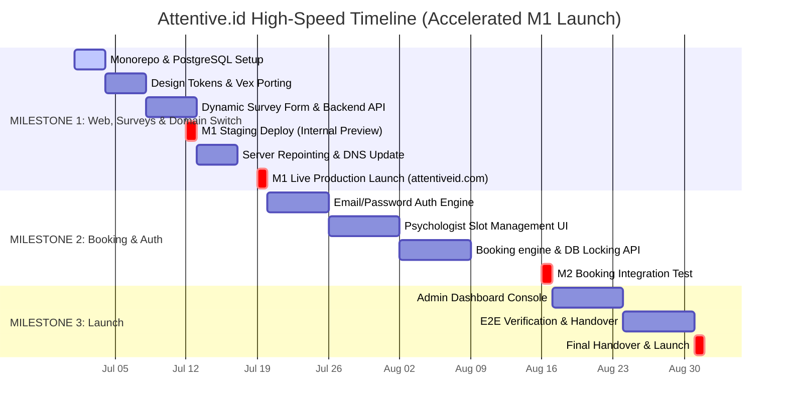

# Implementation Plan & Accelerated Stakeholder Timeline: Attentive.id Refactor

This plan details the migration of `attentiveid.github.io` to a full-stack monorepo (**Bun, Elysia, React, Tailwind CSS v4, shadcn/ui, PostgreSQL**) hosted on **Tencent Cloud VPS via Docker Compose**. 

The timeline has been **highly accelerated** to deliver the **Landing Page, Intake Survey, and DNS cutover to `attentiveid.com` live in Week 3 of July (Target: July 19, 2026)**, with an internal staging preview ready by **Week 2 of July (Target: July 12, 2026)**.

---

## 1. Project Parameters (Decided)
*   **Infrastructure**: Tencent Cloud VPS. Deployment managed via `docker-compose` containing:
    *   `web`: Static built React frontend served via Caddy/Nginx (automatic SSL).
    *   `api`: Bun/Elysia container.
    *   `db`: PostgreSQL container (with persistent volume backups).
*   **Authentication**: Standard Email & Password.
*   **Database**: PostgreSQL.
*   **Integrations**: WhatsApp integration is deferred to Iteration 2.
*   **Server Repointing**: Repoint the DNS records of the existing domain `attentiveid.com` from GitHub Pages hosting to the new Tencent Cloud VPS at the end of Milestone 1.

---

## 2. Accelerated Delivery Timeline (July - August 2026)

*   **Milestone 1 (Target: July 19, 2026 - End of Week 3)**: Core Setup + Landing Page UI Modernization + Intake Survey & Form + **Server DNS Repointing to Tencent VPS & SSL Activation**. (Situs utama dengan tampilan baru resmi live di server baru).
    *   *Staging Preview Target*: July 12, 2026 (End of Week 2) on a temporary VPS ip / subdomain.
*   **Milestone 2 (Target: August 16, 2026 - End of Week 7)**: Auth + Psychologist Slot Management + Booking Engine.
*   **Milestone 3 (Target: August 31, 2026 - End of August)**: Admin Dashboard, Production Hardening, and Handover.

---

## 3. Plane.so Cycles & Issue Cards (Accelerated Schedule)

### Cycle 1 (July 1 - July 12): Foundation, Vex Porting & Staging Preview
*   **ATTN-1: Project Scaffolding & PostgreSQL Integration**
    *   **Priority:** High | **Module:** `MOD-01: Core & Landing` | **Estimate:** 3 Points
    *   **Description:** Initialize monorepo. Scaffold `apps/api` (Elysia) and `apps/web` (React/Vite). Spin up local PostgreSQL container using Docker Compose. Set up database schema connection (Prisma/Drizzle migrations).
*   **ATTN-2: Vex Page Sections Porting & Tailwind v4 Customization**
    *   **Priority:** High | **Module:** `MOD-01: Core & Landing` | **Estimate:** 5 Points
    *   **Description:** Re-create Vex landing page layout using React + Tailwind v4 CSS. Set up fonts, core components (Navbar, Footer, Buttons, Cards), and dynamic content arrays.
*   **ATTN-3: Internationalization (i18n) Logic**
    *   **Priority:** Medium | **Module:** `MOD-01: Core & Landing` | **Estimate:** 2 Points
    *   **Description:** Integrate `react-i18next` with language switching (English & Bahasa Indonesia). Populate language JSON translation files with the original Vex page copy.
*   **ATTN-4: Staging Deployment on Tencent VPS**
    *   **Priority:** High | **Module:** `MOD-04: Infrastructure & DevOps` | **Estimate:** 3 Points
    *   **Description:** Spin up basic `docker-compose` on Tencent VPS with SSL enabled on a staging subdomain (e.g. `staging.attentiveid.com`) for internal preview by July 12.

### Cycle 2 (July 13 - July 19): Dynamic Survey & M1 Production Launch (attentiveid.com)
*   **ATTN-5: Dynamic Intake Survey / Screening UI**
    *   **Priority:** High | **Module:** `MOD-02: Intake & Survey` | **Estimate:** 5 Points
    *   **Description:** Build responsive dynamic intake screening form UI in React. Multi-step navigation, inputs validation, progress indicator, and payload formatting.
*   **ATTN-6: Survey API & PostgreSQL Storage**
    *   **Priority:** High | **Module:** `MOD-02: Intake & Survey` | **Estimate:** 3 Points
    *   **Description:** Elysia POST endpoint for screening submission. Data validation (TypeBox/Zod), writing response records into PostgreSQL.
*   **ATTN-7: DNS Repointing to Tencent VPS & SSL Activation**
    *   **Priority:** High | **Module:** `MOD-04: Infrastructure & DevOps` | **Estimate:** 4 Points
    *   **Description:** Update A/AAAA DNS records for `attentiveid.com` on the domain registrar to point to the new Tencent Cloud VPS IP. Configure automatic Let's Encrypt SSL via Caddy.
*   **ATTN-8: HTTP 301 Permanent Redirect from GitHub Pages**
    *   **Priority:** Medium | **Module:** `MOD-04: Infrastructure & DevOps` | **Estimate:** 2 Points
    *   **Description:** Setup permanent HTTP 301 redirects in Caddy to ensure any traffic going to the old `attentiveid.github.io` URL path is mapped directly to the new VPS on `attentiveid.com`.

### Cycle 3 (July 20 - August 2): Auth & Psychologist Schedules
*   **ATTN-9: JWT Authentication & User/Psychologist Roles**
    *   **Priority:** High | **Module:** `MOD-03: Booking Engine` | **Estimate:** 5 Points
    *   **Description:** Implement email & password signup/signin backend in Elysia. Differentiate user permissions (Admin, Psychologist, Patient) using role-based routing guards.
*   **ATTN-10: Psychologist Slots Planner UI**
    *   **Priority:** High | **Module:** `MOD-03: Booking Engine` | **Estimate:** 5 Points
    *   **Description:** Create interactive calendar board in React for psychologists to input/toggle their daily and hourly availability slots.

### Cycle 4 (August 3 - August 16): Booking Engine & Integration
*   **ATTN-11: Patient Reservation Scheduling Calendar**
    *   **Priority:** High | **Module:** `MOD-03: Booking Engine` | **Estimate:** 5 Points
    *   **Description:** Patient portal view displaying available psychologist profiles and interactive slots calendar. Includes checkout validation.
*   **ATTN-12: Booking Reservation Transaction Engine**
    *   **Priority:** High | **Module:** `MOD-03: Booking Engine` | **Estimate:** 5 Points
    *   **Description:** Elysia booking reservation API. Handle locking slots using database transaction levels (`SERIALIZABLE` or select-for-update) to prevent double-booking. Set status to pending/booked.

### Cycle 5 (August 17 - August 31): Admin Panel & Handover
*   **ATTN-13: Admin Console (Dashboard)**
    *   **Priority:** Medium | **Module:** `MOD-03: Booking Engine` | **Estimate:** 5 Points
    *   **Description:** Dashboard for platform administrator to approve/delete bookings, manage psychologist user accounts, and view user-submitted screening survey results.
*   **ATTN-14: E2E Verification & Handover**
    *   **Priority:** High | **Module:** `MOD-04: Infrastructure & DevOps` | **Estimate:** 3 Points
    *   **Description:** Run final E2E scenario validation. Complete system documentations, handover Git repositories, prepare db backup scripts and hand over administrative access credentials to client.

---

## 4. Verification Plan

### Automated Verification
- Verify database integration via migration scripts.
- Run concurrent booking tests against Elysia endpoints to check for transaction lockouts in PostgreSQL.

### Manual Verification
- Deploy a staging stack on Tencent VPS under a subdomain (e.g. `staging.attentiveid.com`).
- Test user flow: dynamic survey submits correctly -> registers account -> logs in -> books slot on psychologist profile -> psychologist logs in to confirm availability changes.
